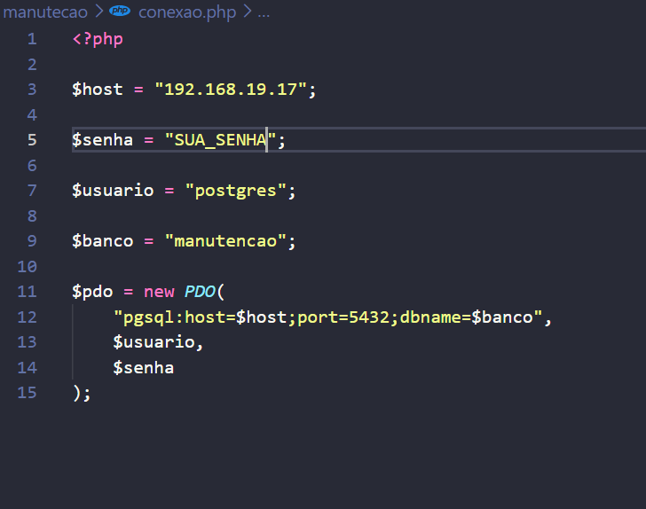
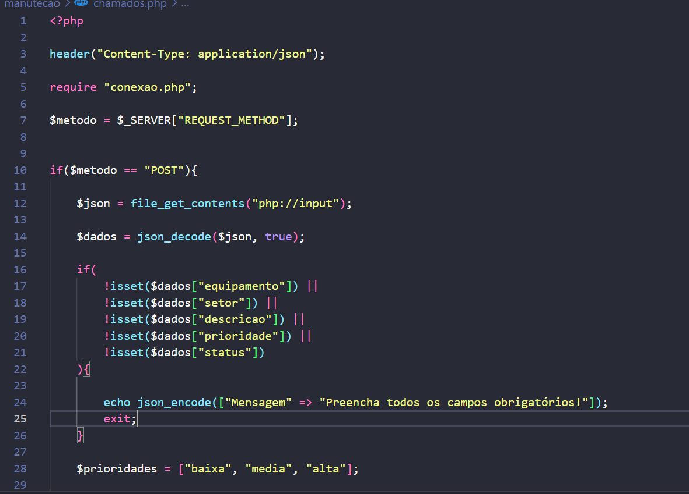
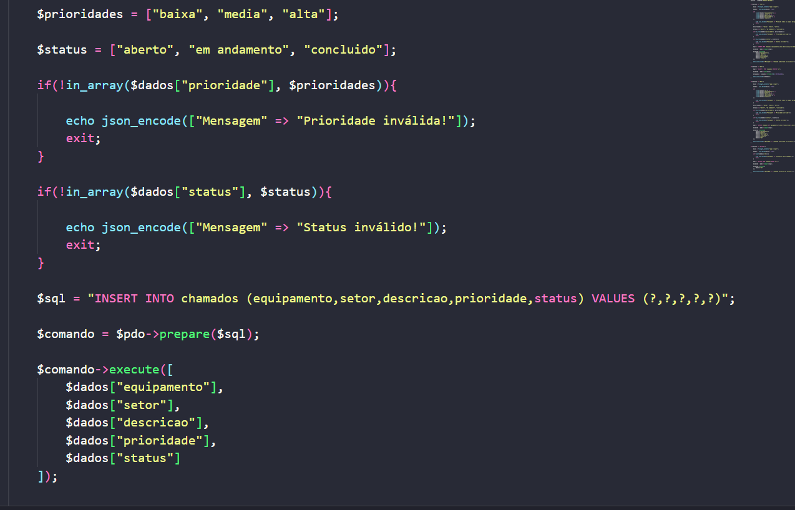
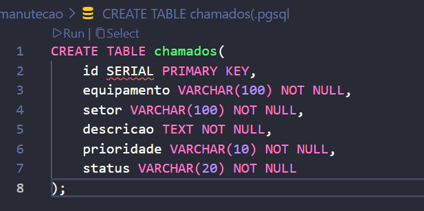

# API para Controle de Manutenção

Ele foi criado para otimizar o tempo e priorizar a praticidade do controle de chamados de manutenção de equipamentos, a API foi feita em PHP e utiliza PostgreSQL para armazenar os chamados

## Tecnologias utilizadas

- PHP
- PostgreSQL
- PDO
- JSON
- API REST

## Banco de dados

Foi criado o banco de dados manutencao, com a tabela chamados

A tabela possui algumas informações importantes como:

- id
- equipamento
- setor
- descricao
- prioridade
- status

## Operações

A API permite realizar as seguintes operações:
A API é utilizada nos seguintes comandos, 'POST' que serve para cadastrar um chamado, 'GET' utilizado para consultar os chamados, 'PUT' para atualizar um chamado e 'DELETE' para excluir um chamado

## Prioridade pedidas

Três níveis de prioridade:

- baixa
- media
- alta

## Status

Os chamados podem estar nos seguintes status:

- aberto
- em andamento
- concluido

## Arquivos do projeto

- `conexao.php` — realiza a conexão com o banco de dados
- `chamados.php` — contém as operações da API

## Objetivo

O objetivo do projeto é colocar em prática a criação de uma API REST utilizando PHP, PostgreSQL e as operações de CRUD

## conexao.php

## chamados.php

## CREATE TABLE 

